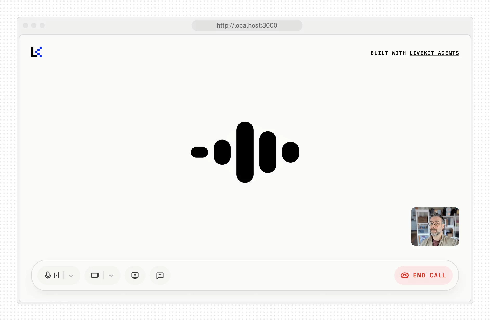

# Agent Starter for React

Comprehensive documentation for the Agent Starter React template.

This repository is a Next.js-based starter for building voice-enabled agents using LiveKit. It includes an opinionated UI, audio/video device controls, live transcription integration, and optional avatar integration. It targets the Next.js App Router and is configured to work with server and edge functions where necessary.

## Table of contents

- Overview
- Features
- Prerequisites
- Quickstart (local)
- Configuration
  - App configuration
  - Environment variables
- Development workflows
  - Local dev
  - Building for production
- Deployment
  - Netlify (recommended with plugin)
  - Static export (limitations)
- Troubleshooting & tips
- Contributing
- License

## Overview

The project provides a small front-end demo that connects to a LiveKit-hosted voice agent. The UI is built with Tailwind CSS and React (Next.js app router). It demonstrates:

- Joining a LiveKit room and using the data channel to chat
- Publishing and subscribing to audio and video tracks
- Live transcription streaming and message merging
- A responsive control bar with microphone, camera, screen share and disconnect controls

This repo is intended as a starting point for building voice-enabled assistants and demos.

## Features

- Real-time voice interaction using LiveKit
- Chat messages over LiveKit data channels
- Microphone/camera selection and device permission handling
- Screen share support
- Transcription integration (merged with chat messages)
- Theme toggle (light/dark) and small component library for the UI

## Prerequisites

- Node.js 18+ (Node 20 recommended)
- pnpm (project uses pnpm by default; Netlify will detect pnpm from the lockfile)
- A LiveKit project (self-hosted or LiveKit cloud) with an API key/secret and server URL

## Quickstart (local)

1. Install dependencies

```powershell
pnpm install
```

2. Create a `.env.local` in the project root (copy `.env.example` if present) and add LiveKit credentials. DO NOT commit secrets to version control.

Example `.env.local` (values shown are placeholders — replace with your keys):

```env
LIVEKIT_URL=wss://your-livekit-host
LIVEKIT_API_KEY=YOUR_API_KEY
LIVEKIT_API_SECRET=YOUR_API_SECRET
NEXT_PUBLIC_APP_CONFIG_ENDPOINT=
SANDBOX_ID=agent-2mauba
```

3. Run the app in development

```powershell
pnpm dev
```

4. Open http://localhost:3000 in your browser.

If you want to try quickly without provisioning your own LiveKit instance, the LiveKit Cloud Sandbox provides a template deploy (see the LiveKit docs). This repo was originally written to work with LiveKit's sandbox templates.

## Configuration

### App configuration

Top-level UI and feature flags are stored in `app-config.ts`. Example default configuration:

```ts
export const APP_CONFIG_DEFAULTS: AppConfig = {
  companyName: 'GameGhor',
  pageTitle: 'Agent Loki',
  pageDescription: 'A voice agent built with AI for Nur Hasan Masum ',
  supportsChatInput: true,
  supportsVideoInput: true,
  supportsScreenShare: true,
  isPreConnectBufferEnabled: true,
  logo: '/lk-logo.svg',
  accent: '#002cf2',
  logoDark: '/lk-logo-dark.svg',
  accentDark: '#1fd5f9',
  startButtonText: 'Start call',
  sandboxId: undefined,
  agentName: undefined,
};
```

Change these defaults in `app-config.ts` to customize branding, feature flags and copy.

### Environment variables

Required environment variables for connecting to LiveKit:

- LIVEKIT_URL — The LiveKit server URL (wss://... for websocket; or ws:// for local dev)
- LIVEKIT_API_KEY — LiveKit API key for your project (server-side only)
- LIVEKIT_API_SECRET — LiveKit API secret (server-side only)

Client-visible configuration should be provided as `NEXT_PUBLIC_*` variables. Example:

```env
NEXT_PUBLIC_APP_CONFIG_ENDPOINT=https://your-config-endpoint
```

Important: Treat `LIVEKIT_API_SECRET` and other server secrets as sensitive. Do not commit them or expose them to client bundles.

## Development workflows

Local development

- Start dev server with: `pnpm dev`
- The app uses the Next.js App Router and server components. When iterating on UI, the dev server will hot-reload client components.

Building for production

- Build locally: `pnpm build`
- Start a production server: `pnpm start`

CI and type checking

- `pnpm build` will run Next.js build which also lints and typechecks the project by default in this repo (see build logs). Fix any lint or Prettier issues flagged during build.

## Deployment

This project is compatible with Netlify using the official Netlify Next.js plugin. The repo includes a `netlify.toml` that configures the plugin to run the Next build and wire up server/edge functions.

### Netlify (recommended for Server / Edge features)

1. Ensure your repo is pushed to GitHub/GitLab/Bitbucket.
2. In Netlify, create a new site and import from Git.
3. Set the following build settings in Netlify UI (or rely on `netlify.toml`):

- Base directory: `.`
- Build command: `pnpm build`
- Publish directory: `.next`

4. Add required environment variables in Netlify (Site settings -> Build & deploy -> Environment):

- LIVEKIT_URL
- LIVEKIT_API_KEY
- LIVEKIT_API_SECRET
- NEXT_PUBLIC_APP_CONFIG_ENDPOINT (if needed)

5. Netlify will run the build and the `@netlify/plugin-nextjs` plugin will map Next server and edge functions to Netlify Functions and Edge Functions.

Notes: Netlify will detect `pnpm` automatically if `pnpm-lock.yaml` is present. If not, set the install command to `corepack enable && pnpm install`.

### Static export (if you must use static hosting only)

- If you don't need SSR/edge functions you can use `next export` and publish the `out/` directory instead — but this removes server rendering, dynamic routing, and middleware features.

## Troubleshooting & tips

- Hydration errors: If you see warnings about hydration mismatches, ensure server-rendered output is deterministic (avoid Date.now(), Math.random() on the server, or move dynamic pieces into client components). The app uses `suppressHydrationWarning` for body to reduce noise caused by browser extensions.
- ESLint / Prettier: The Next build enforces Prettier rules. If `pnpm build` fails with a prettier/prettier error, run `pnpm format` or fix the specific whitespace/format issues.
- LiveKit data channel send issues: Data channel functions (`send`) may be unavailable until permissions and the data channel are ready — code defensively and disable the UI until ready.

Common Netlify issues

- pnpm not detected: ensure `pnpm-lock.yaml` is committed, or set install command to `corepack enable && pnpm install`.
- Missing environment variables: set them in Netlify site settings before first build.

## Contributing

Contributions are welcome. Suggested workflow:

1. Fork the repository
2. Create a topic branch for your change
3. Add tests / update docs
4. Open a PR and describe your change

Please follow the existing code style and run `pnpm format` before opening a PR.

## Security

- Never commit `.env.local` or any file with secrets. Use platform environment variables (Netlify, Vercel, etc.) for production secrets.

If you find a security issue, please open an issue or contact the maintainers directly.

## License

This project is provided under the terms of the MIT License. See the `LICENSE` file for details.

# Agent Starter for React

This is a starter template for [LiveKit Agents](https://docs.livekit.io/agents) that provides a simple voice interface using the [LiveKit JavaScript SDK](https://github.com/livekit/client-sdk-js). It supports [voice](https://docs.livekit.io/agents/start/voice-ai), [transcriptions](https://docs.livekit.io/agents/build/text/), and [virtual avatars](https://docs.livekit.io/agents/integrations/avatar).

Also available for:
[Android](https://github.com/livekit-examples/agent-starter-android) • [Flutter](https://github.com/livekit-examples/agent-starter-flutter) • [Swift](https://github.com/livekit-examples/agent-starter-swift) • [React Native](https://github.com/livekit-examples/agent-starter-react-native)

<picture>
  <source srcset="./.github/assets/readme-hero-dark.webp" media="(prefers-color-scheme: dark)">
  <source srcset="./.github/assets/readme-hero-light.webp" media="(prefers-color-scheme: light)">
  
</picture>

### Features:

- Real-time voice interaction with LiveKit Agents
- Camera video streaming support
- Screen sharing capabilities
- Audio visualization and level monitoring
- Virtual avatar integration
- Light/dark theme switching with system preference detection
- Customizable branding, colors, and UI text via configuration

This template is built with Next.js and is free for you to use or modify as you see fit.

### Project structure

```
agent-starter-react/
├── app/
│   ├── (app)/
│   ├── api/
│   ├── components/
│   ├── fonts/
│   ├── globals.css
│   └── layout.tsx
├── components/
│   ├── livekit/
│   ├── ui/
│   ├── app.tsx
│   ├── session-view.tsx
│   └── welcome.tsx
├── hooks/
├── lib/
├── public/
└── package.json
```

## Getting started

> [!TIP]
> If you'd like to try this application without modification, you can deploy an instance in just a few clicks with [LiveKit Cloud Sandbox](https://cloud.livekit.io/projects/p_/sandbox/templates/agent-starter-react).

[](https://cloud.livekit.io/projects/p_/sandbox/templates/agent-starter-react)

Run the following command to automatically clone this template.

```bash
lk app create --template agent-starter-react
```

Then run the app with:

```bash
pnpm install
pnpm dev
```

And open http://localhost:3000 in your browser.

You'll also need an agent to speak with. Try our starter agent for [Python](https://github.com/livekit-examples/agent-starter-python), [Node.js](https://github.com/livekit-examples/agent-starter-node), or [create your own from scratch](https://docs.livekit.io/agents/start/voice-ai/).

## Configuration

This starter is designed to be flexible so you can adapt it to your specific agent use case. You can easily configure it to work with different types of inputs and outputs:

#### Example: App configuration (`app-config.ts`)

```ts
export const APP_CONFIG_DEFAULTS: AppConfig = {
  companyName: 'LiveKit',
  pageTitle: 'LiveKit Voice Agent',
  pageDescription: 'A voice agent built with LiveKit',

  supportsChatInput: true,
  supportsVideoInput: true,
  supportsScreenShare: true,
  isPreConnectBufferEnabled: true,

  logo: '/lk-logo.svg',
  accent: '#002cf2',
  logoDark: '/lk-logo-dark.svg',
  accentDark: '#1fd5f9',
  startButtonText: 'Start call',

  // for LiveKit Cloud Sandbox
  sandboxId: undefined,
  agentName: undefined,
};
```

You can update these values in [`app-config.ts`](./app-config.ts) to customize branding, features, and UI text for your deployment.

> [!NOTE]
> The `sandboxId` and `agentName` are for the LiveKit Cloud Sandbox environment.
> They are not used for local development.

#### Environment Variables

You'll also need to configure your LiveKit credentials in `.env.local` (copy `.env.example` if you don't have one):

```env
LIVEKIT_API_KEY=your_livekit_api_key
LIVEKIT_API_SECRET=your_livekit_api_secret
LIVEKIT_URL=https://your-livekit-server-url
```

These are required for the voice agent functionality to work with your LiveKit project.

## Contributing

This template is open source and we welcome contributions! Please open a PR or issue through GitHub, and don't forget to join us in the [LiveKit Community Slack](https://livekit.io/join-slack)!
